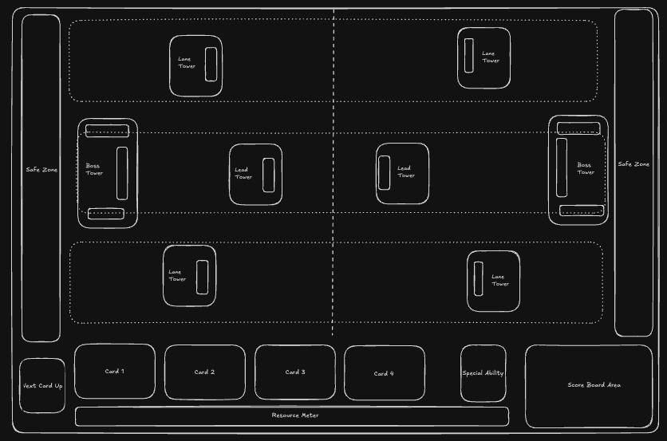

# 🏰 3Siege
### Game Design Document v0.2

---

## 📋 Overview

**Genre:** Real-time Strategy / Tower Offense / Capture the Flag Hybrid  
**Platform:** Web Browser (HTML5)  
**Players:** 1v1 (potential for 2v2 expansion)  
**Match Length:** 3-5 minutes  

**Elevator Pitch:**  
*"Clash Royale meets Capture the Flag — destroying towers is only half the battle. Escort the flag home to claim victory, or steal it to build your own defenses."*

---

## 🎮 Core Gameplay Loop

```
┌───────────────────────────────────────────────────────┐
│     1. BATTLE PHASE              2. CAPTURE PHASE     │
│     ─────────────                ─────────────        │
│     Deploy units                 Escort flag          │
│     Attack towers                Defend carrier       │
│     Defend your side             Intercept/Steal      │
└───────────────────────────────────────────────────────┘
```

### Phase 1: Battle Phase (Continuous)
- Deploy units using regenerating **Elixir** (Clash Royale style)
- **Deploy anywhere on your side** — units walk to the nearest lane
- Units can be pulled into another lane if they lock onto an enemy
- Units will NOT attack enemies from a different lane (must be pulled in first)
- Destroy towers to spawn flags

### Phase 2: Capture Phase (Triggered per tower)
- When a tower is destroyed, a **Flag** spawns at its location
- Closest surviving friendly unit automatically picks up the flag
- Carrier must return flag to their **Safe Zone** to score
- Enemy can intercept and steal the flag

---
## 🗺️ Map Layout


### Tower Configuration (Per Player)
| Tower | Location | Health | Damage | Range | Flag Points |
|-------|----------|--------|--------|-------|-------------|
| **Boss Tower** | Inside Safe Zone | Very High | High | Long | Instant Win |
| **Lead Tower** | Center lane (Lane 2) | High | Medium | Medium | 2 points |
| **Lane Towers (x2)** | Top & Bottom lanes | Medium | Medium | Medium | 1 point each |

**Total: 4 towers per player**

### Lanes
- **Lane 1 (Top)** — Contains Lane Tower
- **Lane 2 (Middle)** — Contains Lead Tower + Boss Tower access  
- **Lane 3 (Bottom)** — Contains Lane Tower

### Safe Zone
- Vertical strip on each player's far edge
- **Boss Tower is INSIDE the Safe Zone** — last line of defense
- Returning a captured flag here = successful capture + tower respawn

---

## 🚩 Flag Mechanics

### Flag Spawning
- Flag appears when a tower reaches 0 HP
- Flag spawns at the tower's location
- Tower debris remains as minor obstacle

### Flag Pickup
- **Automatic:** Closest surviving friendly unit picks up flag
- Unit must be within pickup radius
- If no units nearby, flag remains on ground (contestable)

### Carrier Debuffs
All flag carriers suffer penalties:
| Stat | Effect |
|------|--------|
| Movement Speed | -40% to -60% (varies by unit) |
| Attack Damage | Reduced to 0 (cannot attack while carrying) |
| Attack Speed | N/A |
| Abilities | Disabled |

### Carrier Trait: "Carry Rating"
Some units are better carriers than others:

| Rating | Speed Penalty | Examples |
|--------|---------------|----------|
| ⭐⭐⭐ Excellent | -40% | Runner, Scout |
| ⭐⭐ Average | -50% | Knight, Archer |
| ⭐ Poor | -60% | Giant, Tank |

### Flag Drop
- When carrier dies, flag drops at death location
- Flag remains on ground for **3 seconds** (grace period)
- Any unit (friend or foe) can pick it up
- If no pickup after grace period, flag becomes "contestable"

### Flag Return Outcomes

| Scenario | Result |
|----------|--------|
| **You return YOUR flag** | Tower respawns at original location |
| **Enemy steals and returns YOUR flag** | Tower is permanently lost + enemy gains Minor Tower |

### Flag Stealing
When an enemy picks up YOUR flag:
- They can return it to THEIR Safe Zone
- This creates a **Minor Tower** in their territory
- Your original tower is **permanently destroyed** (cannot respawn)

### Minor Towers (Stolen Flag Reward)
| Aspect | Minor Tower | Original Tower |
|--------|-------------|----------------|
| Health | 50% | 100% |
| Damage | 60% | 100% |
| Range | 80% | 100% |
| Flag on Death | No | Yes |

*Minor towers do NOT drop flags when destroyed*

---

## 🚫 Lane Lockout System

When a tower is destroyed, a special deployment rule kicks in:

### The Rule
| Player | Can Deploy In That Lane? |
|--------|--------------------------|
| **Attacker** (destroyed the tower) | ✅ YES — anywhere in that lane |
| **Defender** (lost the tower) | ❌ NO — locked out of that lane |

### Unlocking a Lane
The defender regains deployment rights when:
- They destroy the **corresponding enemy tower** in that lane

### Example
1. Player 1 destroys Player 2's **Lane 1 Tower**
2. Player 1 can now deploy **anywhere in Lane 1** (to defend carrier, distract, etc.)
3. Player 2 **cannot deploy in Lane 1** at all
4. Player 2 destroys Player 1's Lane 1 Tower → Player 2 can deploy in Lane 1 again

### Strategic Implications
- Destroying a tower gives offensive AND defensive advantage in that lane
- Defenders must rely on units from other lanes or the tower itself
- Creates asymmetric lane control
- Encourages counter-pushing to regain lane access

---

## 🏆 Victory Conditions

### Primary Win Conditions
1. **Boss Tower Capture** — Destroy enemy Boss Tower AND return its flag = **Instant Win**
2. **Total Domination** — Capture all 4 enemy tower flags
3. **Time Victory** — Most points when timer expires

### Scoring
| Action | Points |
|--------|--------|
| Capture Lane Tower Flag (x2 available) | 1 point each |
| Capture Lead Tower Flag | 2 points |
| Capture Boss Tower Flag | **Instant Win** |
| Build Minor Tower (stolen flag) | 1 point |
| Tower Damage | Tiebreaker only |

**Max Points (without Boss capture):** 4 points per side (1 + 1 + 2 + potential steals)

### Tiebreaker
If points are equal at time expiry:
1. Total tower damage dealt
2. Units deployed
3. Sudden death overtime (first capture wins)

---

## ⚔️ Units (Initial Roster)

### Common Units

#### 🗡️ Knight
| Stat | Value |
|------|-------|
| Elixir Cost | 3 |
| Health | Medium |
| Damage | Medium |
| Speed | Medium |
| Carry Rating | ⭐⭐ |
| Role | Balanced frontline |

#### 🏃 Runner
| Stat | Value |
|------|-------|
| Elixir Cost | 2 |
| Health | Low |
| Damage | Low |
| Speed | Fast |
| Carry Rating | ⭐⭐⭐ |
| Role | Flag carrier specialist |

#### 🏹 Archer
| Stat | Value |
|------|-------|
| Elixir Cost | 3 |
| Health | Low |
| Damage | Medium |
| Speed | Medium |
| Range | Long |
| Carry Rating | ⭐⭐ |
| Role | Ranged support |

#### 🛡️ Tank
| Stat | Value |
|------|-------|
| Elixir Cost | 5 |
| Health | Very High |
| Damage | Low |
| Speed | Slow |
| Carry Rating | ⭐ |
| Role | Damage sponge |

### Rare Units

#### ⚡ Assassin
| Stat | Value |
|------|-------|
| Elixir Cost | 4 |
| Health | Low |
| Damage | Very High |
| Speed | Very Fast |
| Carry Rating | ⭐⭐⭐ |
| Special | First strike bonus damage |
| Role | Flag interceptor |

#### 🔨 Siege Breaker
| Stat | Value |
|------|-------|
| Elixir Cost | 6 |
| Health | High |
| Damage | High vs Buildings |
| Speed | Slow |
| Carry Rating | ⭐ |
| Special | 2x damage to towers and walls |
| Role | Tower destruction |

### Epic Units

#### 👑 Commander
| Stat | Value |
|------|-------|
| Elixir Cost | 5 |
| Health | Medium |
| Damage | Medium |
| Speed | Medium |
| Carry Rating | ⭐⭐ |
| Special | Nearby allies +20% speed |
| Role | Escort support |

#### 🌀 Portal Mage
| Stat | Value |
|------|-------|
| Elixir Cost | 4 |
| Health | Low |
| Damage | Low |
| Speed | Medium |
| Carry Rating | ⭐⭐ |
| Special | Can teleport flag carrier short distance (once) |
| Role | Utility / escape |

---

## 💎 Resource Systems

### Elixir (Battle Resource)
- Regenerates over time (1 elixir per 2.8 seconds)
- Max capacity: 10 elixir
- Used to deploy units
- Regeneration increases in overtime


---

## ⚡ Special Ability System

Each player selects **one Special Ability** before the match (separate from their unit deck).

### Ability Properties
- **Cooldown-based** — Does NOT cost elixir
- **Single slot** — Only one ability per match
- **Strategic timing** — Long cooldowns encourage saving for key moments

### Example Special Abilities

| Ability | Cooldown | Effect |
|---------|----------|--------|
| **Rally** | 45s | All friendly units gain +30% speed for 5 seconds |
| **Fortify** | 60s | All towers gain a 500 HP shield for 8 seconds |
| **Haste Flag** | 40s | Current flag carrier ignores speed penalty for 4 seconds |
| **Recall** | 50s | Teleport flag carrier back to Safe Zone (flag stays with them) |
| **Smoke Screen** | 35s | All units in target area become untargetable for 3 seconds |
| **Tower Strike** | 55s | Deal 300 damage to target enemy tower |
| **Reinforce** | 45s | Spawn 3 basic militia units at your Safe Zone |
| **Steal Vision** | 30s | Reveal all enemy unit positions for 5 seconds |

### Strategic Considerations
- **Rally** + escort formation = fast flag returns
- **Fortify** = stall when enemy is pushing
- **Recall** = emergency flag save (use wisely, long cooldown)
- **Smoke Screen** = protect carrier through dangerous zones

---

## 🎯 Strategic Depth

### Offensive Strategies
1. **Rush** — Quick cheap units, overwhelm early
2. **Siege** — Siege Breakers + support, slow tower destruction
3. **Split Push** — Pressure multiple lanes simultaneously
4. **Bait & Switch** — Fake push one lane, strike another

### Defensive Strategies
1. **Turtle** — Defensive units, wait for counter-attack opportunity
2. **Interception** — Fast units positioned to steal flags
3. **Lane Defense** — Focus resources on protecting key lanes

### Flag Strategies
1. **Escort Formation** — Surround carrier with defensive units
2. **Decoy Run** — Send units ahead to draw fire
3. **Relay** — Intentionally drop flag for better carrier
4. **Steal & Build** — Focus on stealing flags for minor towers

---

## 🖥️ Technical Specifications

### Platform
- **Pure Browser-Based** (HTML5)
- No downloads or plugins required
- Desktop and tablet support (mobile stretch goal)

### Technology Stack (Recommended)
```
Frontend:
├── HTML5 Canvas or WebGL (Pixi.js / Phaser 3)
├── JavaScript/TypeScript
├── CSS3 for UI elements
│
Backend (for multiplayer):
├── Node.js + WebSocket (Socket.io)
├── Redis for matchmaking
├── PostgreSQL for accounts/stats
│
Alternative (Simpler):
├── Peer-to-peer with WebRTC
├── LocalStorage for single-player progress
```

### Browser Requirements
- Chrome 80+, Firefox 75+, Safari 13+, Edge 80+
- WebSocket support
- Hardware acceleration recommended

### Performance Targets
| Metric | Target |
|--------|--------|
| Frame Rate | 60 FPS |
| Input Latency | <50ms |
| Network Latency | <100ms acceptable |
| Load Time | <3 seconds |

### Sprite & Art Options

| Option | Pros | Cons | Cost |
|--------|------|------|------|
| **Kenney Assets** | High quality, consistent style, free | Limited fantasy/medieval options | Free |
| **itch.io Packs** | Huge variety, many free options | Inconsistent styles between packs | Free - $20 |
| **OpenGameArt** | Free, large library | Quality varies widely | Free |
| **Pixel Art (Custom)** | Unique style, full control | Time consuming, skill required | Time |
| **AI Generated** | Fast iteration, unique | May need cleanup, consistency issues | Free - $20/mo |
| **Simple Shapes** | Fast prototype, no assets needed | Not visually appealing for release | Free |

#### Recommended Sprite Packs (Free)

**For Prototyping:**
- **Kenney** (kenney.nl) — Clean, consistent 2D assets
- **Simple shapes** — Colored circles/squares for MVP

**For Production:**
- [Ninja Adventure](https://pixel-boy.itch.io/ninja-adventure-asset-pack) — Huge free pack with characters, tiles, effects
- [Tiny Swords](https://pixelfrog-assets.itch.io/tiny-swords) — Medieval theme, towers, knights
- [Fantasy Heroes](https://brullov.itch.io/fantasy-heroes-character-editor) — Character sprites

**For Quick Custom Sprites:**
- **Aseprite** ($20) — Best pixel art editor
- **Piskel** (free) — Browser-based pixel art
- **LibreSprite** (free) — Aseprite fork

#### Prototype Sprites (MVP Approach)

**Method:** Colored circles with emoji overlays — provides visual distinction (color) plus character recognition (emoji).

| Unit | Emoji | Circle Color | Size |
|------|-------|--------------|------|
| Knight | ⚔️ | Blue | Normal |
| Runner | 🏃 | Green | Normal |
| Archer | 🏹 | Yellow | Normal |
| Tank | 🛡️ | Gray | Large |
| Assassin | ⚡ | Purple | Normal |
| Siege Breaker | 🔨 | Orange | Large |
| Commander | 👑 | Gold | Normal |
| Portal Mage | 🌀 | Cyan | Normal |

| Structure | Emoji |
|-----------|-------|
| Towers | 🏰 or 🗼 |
| Flags | 🚩 |

**Implementation:**
- Circles rendered via canvas `arc()` method
- Emojis rendered via canvas `fillText()` centered on circle
- Animate position, scale, and rotation as needed

---

## 📱 UI/UX Layout

```
┌────────────────────────────────────────────────────────────────────────────────────┐
│                                                                                     │
│                                                                                     │
│                                                                                     │
│                                    GAME MAP                                         │
│                              (Full browser width)                                   │
│                                  (See above)                                        │
│                                                                                     │
│                                                                                     │
│                                                                                     │
├────────────────────────────────────────────────────────────────────────────────────┤
│                                                                                     │
│ ┌─────────┐  ┌────────┐ ┌────────┐ ┌────────┐ ┌────────┐  ┌─────────┐  ┌─────────┐ │
│ │  NEXT   │  │        │ │        │ │        │ │        │  │ SPECIAL │  │  SCORE  │ │
│ │  CARD   │  │ CARD 1 │ │ CARD 2 │ │ CARD 3 │ │ CARD 4 │  │ ABILITY │  │  BOARD  │ │
│ │   UP    │  │        │ │        │ │        │ │        │  │         │  │  AREA   │ │
│ └─────────┘  └────────┘ └────────┘ └────────┘ └────────┘  └─────────┘  └─────────┘ │
│                                                                                     │
│ ┌──────────────────────────────────────────────────────────────────┐               │
│ │                        RESOURCE METER                            │               │
│ │  ▓▓▓▓▓▓▓▓▓▓▓▓▓▓▓▓▓▓▓▓▓▓▓▓▓▓▓▓░░░░░░░░░░░░  7/10 Elixir          │               │
│ └──────────────────────────────────────────────────────────────────┘               │
│                                                                                     │
└────────────────────────────────────────────────────────────────────────────────────┘
```

### HUD Elements

| Element | Purpose |
|---------|---------|
| **Next Card Up** | Preview of the next card in your deck rotation |
| **Cards 1-4** | Currently available unit cards to deploy |
| **Special Ability** | Unique ability slot (cooldown-based, not elixir) |
| **Score Board Area** | Shows captured flags, time remaining, current score |
| **Resource Meter** | Elixir bar showing current/max resources |

### Deck Configuration

- **Deck Size:** 8 cards per player
- **Hand Size:** 4 cards visible at a time + 1 "next card" preview
- Cards cycle through the deck as they are played

---

## 🗓️ Development Roadmap

### Phase 1: Prototype (MVP)
- [ ] Basic map rendering (full width, 3 lanes)
- [ ] Tower placement and health
- [ ] Simple unit movement and combat
- [ ] Basic flag pickup and return
- [ ] Single player vs AI (simple)

### Phase 2: Core Features
- [ ] Lane lockout system
- [ ] Flag stealing mechanics
- [ ] Minor tower creation
- [ ] Tower respawn on flag return
- [ ] Full unit roster (8 units)
- [ ] Elixir system
- [ ] Win conditions

### Phase 3: Multiplayer
- [ ] WebSocket server
- [ ] Matchmaking
- [ ] Spectator mode
- [ ] Replay system

### Phase 4: Polish
- [ ] Sound effects and music
- [ ] Visual effects (particles, animations)
- [ ] Tutorial
- [ ] Ranked mode
- [ ] Deck building

---

## ✅ Design Decisions

| Decision | Resolution |
|----------|------------|
| **Deck size** | 8 cards per player (Clash Royale style) |
| **Overtime mechanics** | Games that go through overtime end in a draw (temporary solution) |
| **Disconnection handling** | Allow reconnection; opponent can continue attacking during disconnect |

## ❓ Open Questions

1. **Unlockables** — Progression system? Cosmetics?
2. **AI difficulty** — How sophisticated should bot opponents be?

---

## 📝 Version History

| Version | Date | Changes |
|---------|------|---------|
| 0.2 | Dec 2024 | Added deck size (8 cards), overtime/disconnect handling decisions, prototype sprites (emoji+circles) |
| 0.1 | Initial | Core concept documentation |

---

*Document maintained by: Development Team*  
*Last updated: December 2024*

